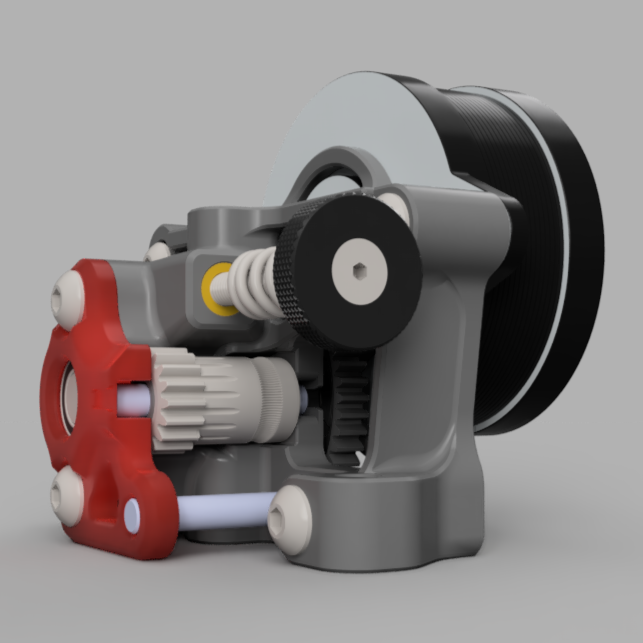
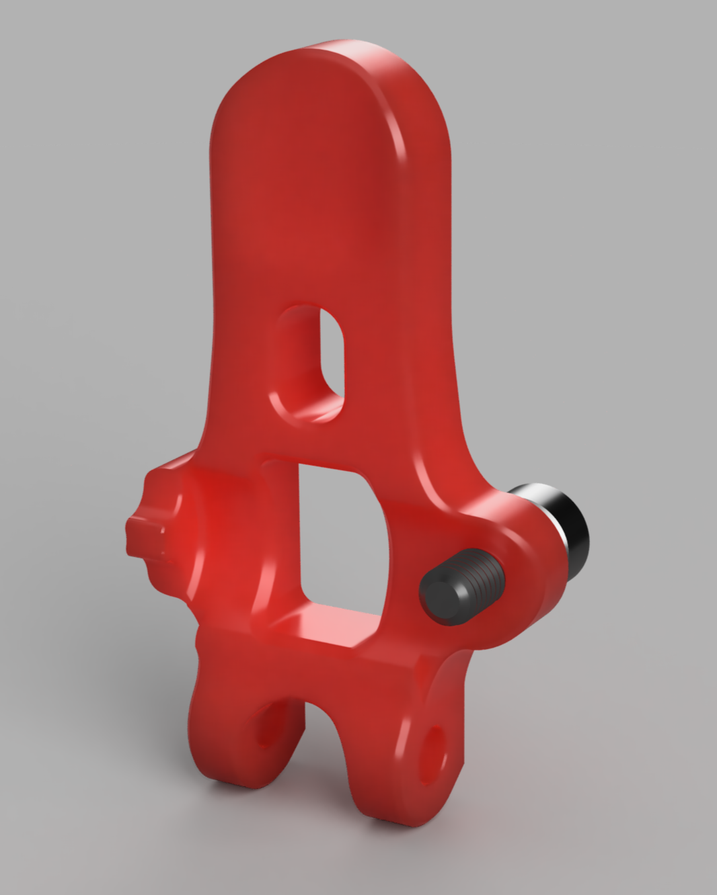

# Sherpa *Zero* (*0°*) [Issue #6](https://github.com/VoronDesign/Voron-Afterburner/issues/6) Mitigator

## Product Info

The Sherpa *Zero* (*0°*) adaptation of the Sherpa Mini mitigates the backlash on the set of Bondtech 5mm gears.  It is designed to allow for smooth layer stacking (provided no other motion parts on your printer have any issues), mitigating the pesky [Voron Issue #6](https://github.com/VoronDesign/Voron-Afterburner/issues/6) and [Prusa3d Issue #602](https://github.com/prusa3d/Prusa-Firmware/issues/602).  It is compact and it uses a single additional screw mounted on the guilder to adjust the backlash of the front gears.  One should adjust this screw until there is no noticeable play (but no further) in the front gears.

For ultimate performance in terms of elimination of [Issue #6](https://github.com/VoronDesign/Voron-Afterburner/issues/6), one might consider using the [Sherpa *Crew* Mini](https://github.com/jrlomas/Sherpa-Crew-Mini).  However, the design of the  [Sherpa *Crew* Mini](https://github.com/jrlomas/Sherpa-Crew-Mini)  adds weight and cost to the build.  In terms of the cost, and weight, the Sherpa *0°* is superior to the [Sherpa *Crew* Mini](https://github.com/jrlomas/Sherpa-Crew-Mini) at the expense of performance.

Pushing the screw against the shaft too tightly will cause the front gears to wear out prematurely. 
On the STL directory there is a version of the front housing for the mantis toolhead (do not print this STL if you do not intend on mounting the Sherpa Zero on a mantis toolhead).

## Mechanics
The extruder uses the main housing and the front housing to support the idler gear in a floating configuration.  The guilder then pushes against the inner right hand-size of the idler gear, and a M3 screw pushes against the left hand-size of the idler gear.  It effectively makes the angle of the shaft adjustable, as to mesh the front gears without any backlash.

# License
 As a derivate work from Annex Engineering, the product [license](https://github.com/Annex-Engineering/ANNEX-Engineering-License-Agreement) is the same as the original [Sherpa Mini]

# Acknowledgments
Thanks to: [Aneex Engineering](https://store.annex.engineering/) for the original design.